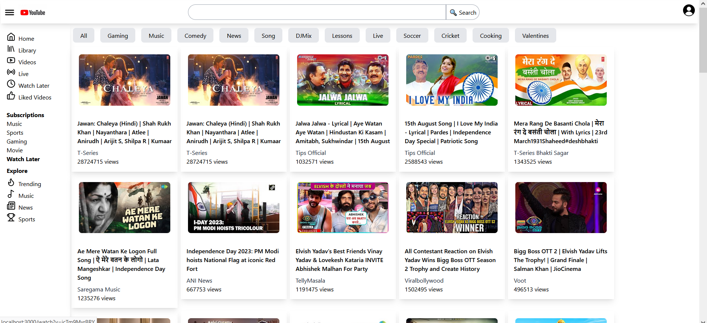
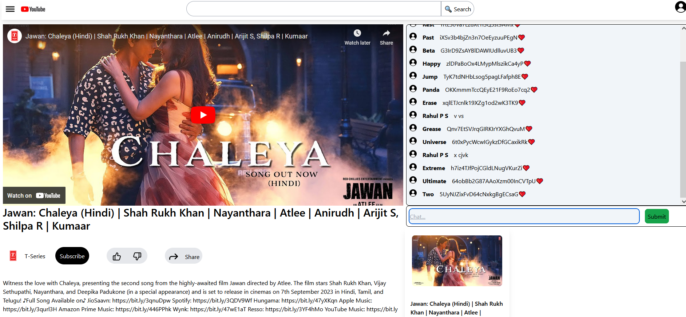
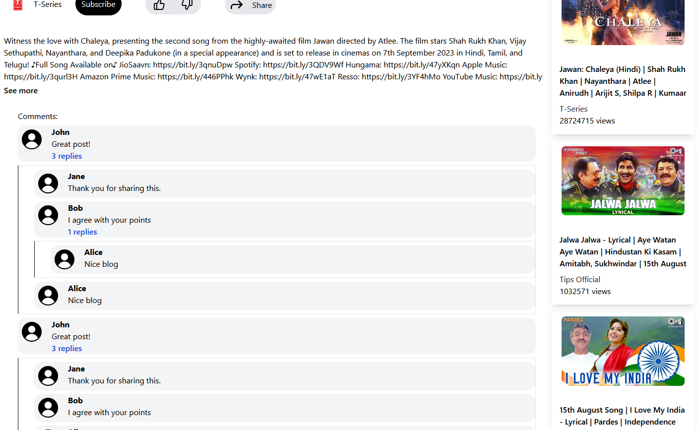
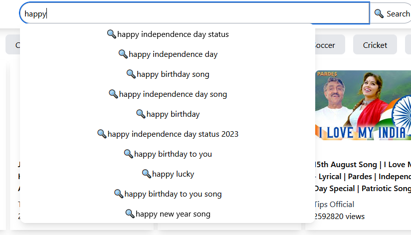

📺 Engineered high-performance video streaming app with React, Redux & Youtube Live API. ⚡️Optimized search, lazy loading, live chat, and cache. 🎥 Enhanced UX with debouncing and custom hooks. #ReactStreamingApp

"Developed a scalable and performant video streaming app using
 
React, 
Tailwind,  React Router,  and Redux,  powered by Youtube's Live API.  Implemented debouncing with a 200ms delay to reduce API calls on frequent key presses,  Optimized search by storing results in the cache using Redux store.
 
Used lazy loading with Suspense and custom hooks to enhance user experience and performance, and  Implemented live chat using API polling.
 Config-driven UI and nested comments also implemented, along with shimmer UI for loading animations."

home page

watch page and live chat

nested comments

search suggestions

